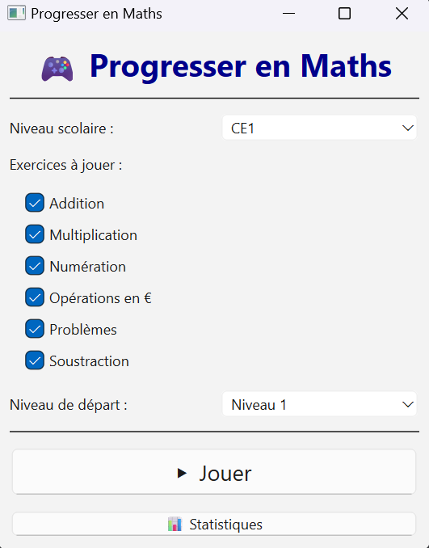
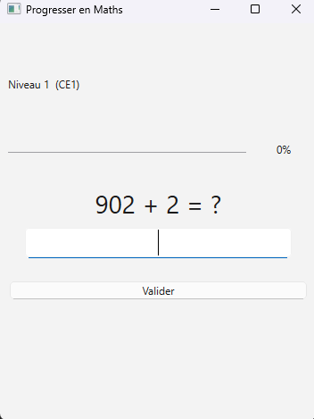
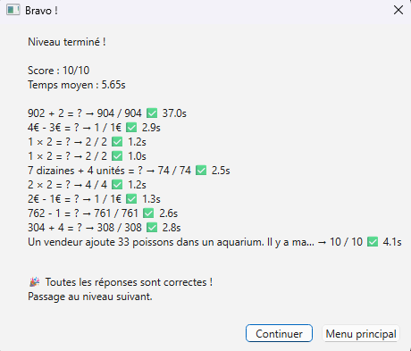
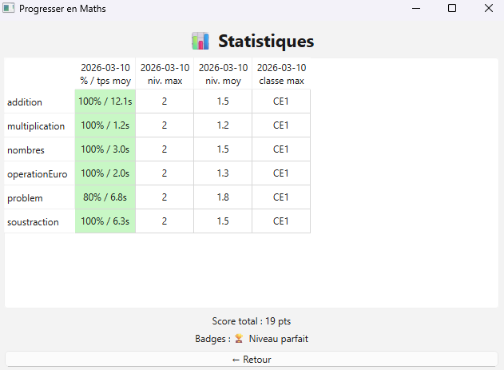

# MathChildGame

Jeu de mathématiques pour enfant de primaire, niveau CP/CE1/CE2.
Apprentissage des additions, soustractions, multiplications, conversions en euros, problèmes...

## Fenêtre principale de sélection de niveau scolaire et exercices

## Exemple de pop-up exercice

## Statistiques à la fin d'un niveau 

## Statistiques globale

## Extensibilité des exercices

Les exercices sont des plugins basés sur une classe mère et peuvent être facilement étendus.